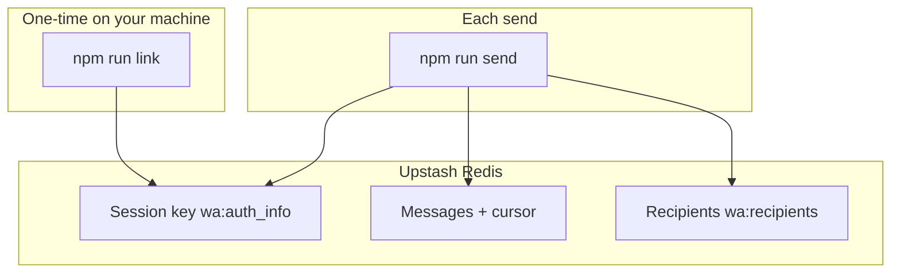
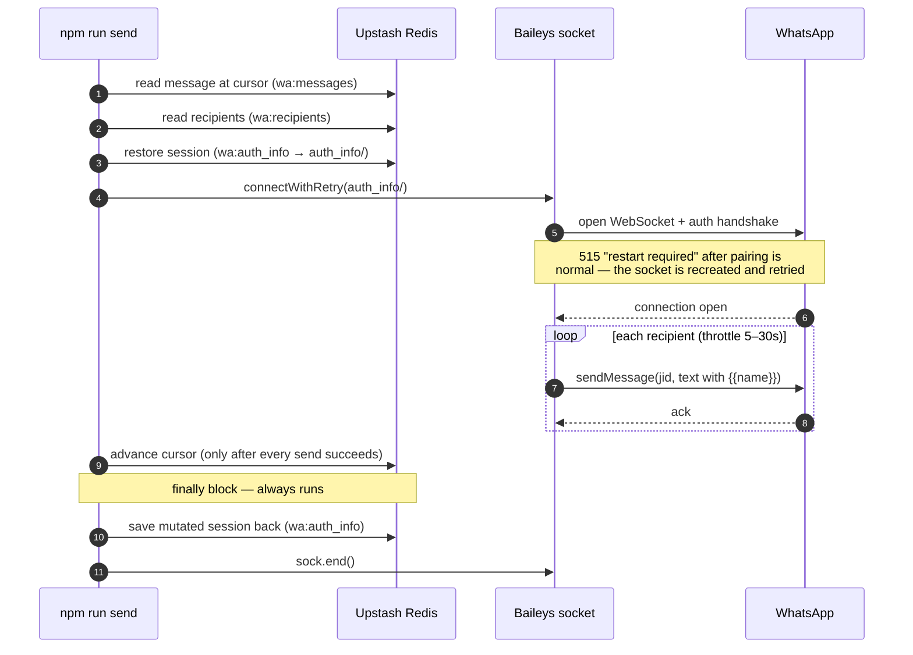

# cronwhats

Schedule and send WhatsApp messages from **GitHub Actions** using [Baileys](https://github.com/WhiskeySockets/Baileys). Session, message rotation, and recipient lists all live in [**Upstash Redis**](https://upstash.com), so CI runners stay **stateless**: restore the linked device, send, persist the updated session.

**Stack:** Node 20+ · ES modules · `@upstash/redis` · Baileys 6.x

---

## Contents

- [Why Redis](#why-redis)
- [Quick start](#quick-start)
- [Commands](#commands)
- [Environment variables](#environment-variables)
- [Linking the device](#linking-the-device)
- [Messages and recipients](#messages-and-recipients)
- [Sending (local and CI)](#sending-local-and-ci)
- [Repository layout](#repository-layout)
- [Troubleshooting](#troubleshooting)
- [Risks and limits](#risks-and-limits)
- [Roadmap](#roadmap)

---

## Why Redis



| Piece | Role |
| --- | --- |
| **Session (`wa:auth_info`)** | Baileys stores many small files; this repo snapshots the whole folder as one JSON object in Redis. You **must** save back after every connection — Baileys mutates keys and creds on each run. |
| **Messages + cursor** | `wa:messages` is a JSON array of strings. `wa:messages:cursor` is the next index. The cursor advances **only after a successful send**, so a failed run retries the same text. |
| **Recipients** | `wa:recipients` is a JSON array of `{ to, name? }` or bare phone strings. |

---

## Quick start

1. **Clone and install**

   ```bash
   git clone <this-repo> && cd whatsapp
   npm install
   ```

2. **Upstash** — Create a Redis database at [upstash.com](https://upstash.com). In the console, copy the **REST URL** and **REST token** (not the `redis://` URL).

3. **Env file**

   ```bash
   cp .env.example .env
   # Edit .env: UPSTASH_REDIS_REST_URL, UPSTASH_REDIS_REST_TOKEN
   ```

4. **Pair once** (QR in the terminal — use a **secondary / test** number if you can)

   ```bash
   npm run link
   ```

   WhatsApp on the phone: **Settings → Linked devices → Link a device → Scan QR code**.

5. **Seed lists** — Edit `src/data/recipients.js` and `src/data/messages.js`, then:

   ```bash
   npm run recipients:seed
   npm run messages:seed
   ```

6. **Verify** — `npm run doctor` checks config (no WhatsApp). `npm run send -- --dry-run`
   prints the next message and each personalized line **without** connecting to WhatsApp
   (still reads message + recipients from Upstash; cursor unchanged).

7. **GitHub Actions** — Add repository secrets `UPSTASH_REDIS_REST_URL` and `UPSTASH_REDIS_REST_TOKEN` (same values as `.env`). The workflow [`.github/workflows/send.yml`](.github/workflows/send.yml) runs on a schedule and can be triggered manually.

Run scripts from the **repository root** (`npm run …` or `node src/commands/<name>.js`).

---

## Commands

| Script | Description |
| --- | --- |
| `npm run link` | One-time pairing; writes the Baileys session to Redis and local `auth_info/`. |
| `npm run doctor` | Preflight: env, session, recipients, messages — pretty output, no send. |
| `npm run send` | Restore session → connect → send current message to all recipients → save session. Use `npm run send -- --dry-run` to print plan only (no connect, no cursor advance). |
| `npm run messages:seed` | Push `src/data/messages.js` to Upstash **and reset the cursor** to the first message. |
| `npm run recipients:seed` | Push `src/data/recipients.js` to Upstash. |
| `npm run group-id -- --list` | List group JIDs (`@g.us`) for the linked account. |
| `npm run group-id -- <invite-url-or-code>` | Resolve a group JID from a WhatsApp invite link. |
| `npm run auth:clear` | Delete the session key in Upstash **and** remove local `./auth_info` (safe if the folder is already gone). |

**CLI errors:** failures are printed in a framed, readable format to stdout. Set `DEBUG=1` to include stack traces where supported.

---

## Environment variables

| Variable | Required | Default | Notes |
| --- |:---:| --- | --- |
| `UPSTASH_REDIS_REST_URL` | yes | — | REST API URL from Upstash. |
| `UPSTASH_REDIS_REST_TOKEN` | yes | — | REST token from Upstash. |
| `MIN_DELAY_MS` / `MAX_DELAY_MS` | no | `5000` / `30000` | Random pause between each recipient send (anti-ban). |
| `DRY_RUN` | no | — | Set to `1` for same behavior as `send -- --dry-run`. |
| `AUTH_DIR` | no | `./auth_info` | Local directory used while restoring/saving the session. |
| `LINK_FRESH` | no | — | Set to `1` / `true` / `yes` before `link` to wipe Redis session + local `auth_info` for a clean QR. |
| `LOG_LEVEL` | no | `silent` | Pino / Baileys; try `debug` when diagnosing. |
| `UPSTASH_AUTH_KEY` | no | `wa:auth_info` | Override Redis key for the session snapshot. |
| `UPSTASH_MESSAGES_KEY` | no | `wa:messages` | Message list key. |
| `UPSTASH_MESSAGES_CURSOR_KEY` | no | `wa:messages:cursor` | Cursor key. |
| `UPSTASH_MESSAGES_COUNT_KEY` | no | `wa:messages:count` | Integer list length; set on `messages:seed`, kept in sync on read. |
| `UPSTASH_RECIPIENTS_KEY` | no | `wa:recipients` | Recipients key. |

See [`.env.example`](.env.example) for copy-paste comments. `.env` is loaded from the **repo root** first, then the current working directory ([`src/lib/env.js`](src/lib/env.js)).

---

## Linking the device

- **QR only** — no phone-number pairing flow; widen the terminal if the QR looks cramped.
- **Stale session** — no QR, immediate logout, or half-linked state: run `LINK_FRESH=1 npm run link` and scan the new QR quickly.
- **Device limit** — remove old **Chrome / Desktop** linked devices in WhatsApp if you are capped.
- **Same phone trap** — linking the WhatsApp app that is already active on that phone to “itself” as a desktop client is awkward; prefer a **second line** or test account.

`npm run auth:clear` clears Redis and deletes `./auth_info`; follow with `npm run link` if you need a new session.

---

## Messages and recipients

Lists are **edited in code** under `src/data/`, then pushed with seed scripts. There is **no** `MESSAGE` environment variable.

### Messages (`src/data/messages.js`)

```js
export default [
  'Good morning {{name}}!',
  'Second line in the rotation.',
];
```

- `{{name}}` is replaced per recipient (empty if no `name`).
- Re-seed anytime: **`npm run messages:seed`** uploads the list, writes **`wa:messages:count`** = list length, sets the cursor to **0**, so the next send starts at the first line.
- On each read, if **count ≠ list.length** (e.g. list edited in the console), **count is repaired** to match; the cursor is still applied with **`% list.length`** so it never goes out of range.

### Recipients (`src/data/recipients.js`)

```js
export default [
  { to: '919876543210', name: 'Asha' },
  { to: '120363123456789012@g.us', name: 'Team' },
  '919999999999',
];
```

- **`to`** — International **digits only** (e.g. `91…`) **or** a group JID ending in `@g.us`.
- **Groups** — The linked account must already be in the group. Use `npm run group-id` to discover JIDs (see [Commands](#commands)).

---

## Sending (local and CI)

How a single `send` connects to WhatsApp and delivers the current message:



If any send throws, the cursor is **not** advanced (the next run retries the same
message), but the session is still saved in the `finally` block.

| Where | How |
| --- | --- |
| **Local** | `npm run send` with `.env` present and lists seeded. |
| **Dry run** | `npm run send -- --dry-run` or `DRY_RUN=1 npm run send` — prints message and recipients; **does not** open WhatsApp or advance the cursor. |
| **GitHub Actions** | Workflow **Send WhatsApp messages**: cron **00:30 UTC** (~**06:00 IST**, no DST) plus **workflow_dispatch**. Runs `node src/commands/send.js` with secrets. |

**Concurrency:** the workflow uses a single concurrency group (`whatsapp-send`, `cancel-in-progress: false`) so two jobs never write the same session concurrently.

GitHub’s scheduler is best-effort; runs can slip by a few minutes.

---

## Repository layout

```
src/lib/
  env.js           Load .env (repo root + cwd); requireUpstashEnv()
  redis.js         Lazy Upstash client, KEYS, Baileys auth snapshot I/O
  whatsapp.js      connectWithRetry / Baileys wrapper
  messages.js      Rotation + seed; stores list, cursor, and `messagesCount` in Redis
  recipients.js    Load, validate, personalize, JID formatting
  cli-print.js     Shared “graceful” CLI error formatting
  util.js          Small helpers (e.g. sleep)

src/data/
  messages.js      Default message list (export default array)
  recipients.js    Default recipient list (export default array)

src/commands/
  link.js          Pair device → Upstash + local auth
  send.js          Main send path (+ dry-run)
  doctor.js        Preflight checks
  group-id.js      List or resolve group JIDs
  messages-seed.js recipients-seed.js   Push src/data → Redis
  auth-clear.js    Clear session in Redis + local auth_info

.github/workflows/send.yml   Scheduled + manual send
```

---

## Troubleshooting

| Symptom | What to try |
| --- | --- |
| Missing env / Redis errors | `cp .env.example .env`, fill REST URL + token; run `npm run doctor`. |
| No QR / instant logout | `LINK_FRESH=1 npm run link` or `npm run auth:clear` then `npm run link`. |
| “No session” in CI | Run `npm run link` locally once; confirm secrets match your Upstash instance. |
| Wrong group target | `npm run group-id -- --list` or resolve invite URL; paste full `@g.us` into recipients. |
| Verbose Baileys logs | `LOG_LEVEL=debug npm run send` (noisy). |

---

## Risks and limits

- **Terms of service** — Unofficial clients can get numbers restricted or banned. Prefer a **dedicated** WhatsApp line and low volume.
- **Throttling** — Defaults space sends randomly between 5s and 30s; tune with `MIN_DELAY_MS` / `MAX_DELAY_MS`.
- **Session drift** — Always let `send` finish its `finally` (saves session). Avoid overlapping sends against the same Redis auth key.
- **Node** — Requires **Node ≥ 20** ([`package.json`](package.json) `engines`).

---

## Roadmap

- In-process scheduler, per-recipient queues, media templates, delivery receipts.
